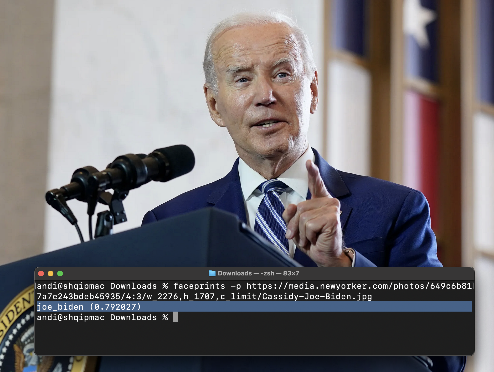
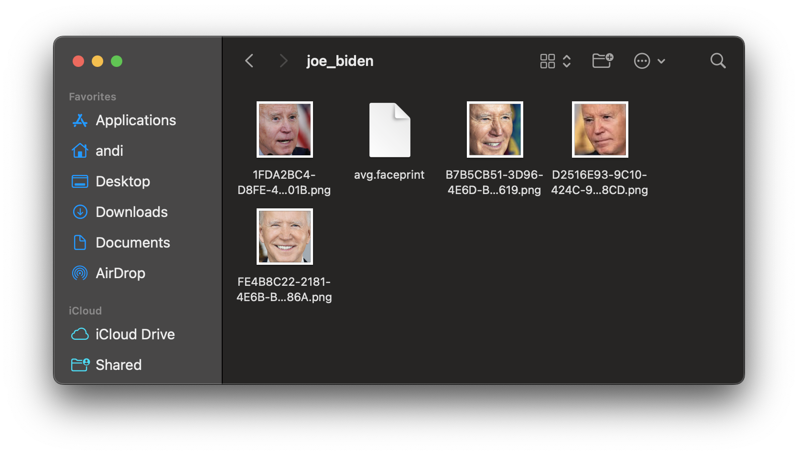

# Faceprints

Faceprints is a Swift CLI tool that recognizes faces in photos. It integrates seamlessly with other shell tools and scripts to provide a simple way to automate tasks that require facial recognition. It is built off the work in [seeV](https://github.com/nexuist/seev).

> A `Faceprint` is like a fingerprint for a face. It's a unique embedding that can be used to compare faces and determine if they are the same person.

Faceprints manages a faceprint index stored in your home directory. You can add and remove faceprints as well as classify faces in arbitrary photos. **It requires no Internet connection or third party models.**

## Supported Operations

### Classify a Photo

```sh
faceprints <image path | image URL>
```

```sh
faceprints https://media.newyorker.com/photos/649c6b817a7e243bdeb45935/4:3/w_2276,h_1707,c_limit/Cassidy-Joe-Biden.jpg
```

```json
{
  "operation" : "classify",
  "input" : "https:\/\/media.newyorker.com\/photos\/649c6b817a7e243bdeb45935\/4:3\/w_2276,h_1707,c_limit\/Cassidy-Joe-Biden.jpg",
  "faces": [
    {
      "topLabel": "joe_biden",
      "topConfidence": 0.80113577842712402,
      "ranks": {
        "joe_biden": 0.80113577842712402,
        "donald_trump": 0.77889835834503174,
      },
      "boundingBox" : {
        "width": 0.16982962191104889,
        "x": 0.4446871280670166,
        "y": 0.62361294031143188,
        "height": 0.22643950581550598
      }
      "faceConfidence": 0.83356118202209473
    }
  ]
}
```

#### Plaintext Responses

Use the `-p` flag to return a simple plaintext response.

```sh
faceprints -p https://media.newyorker.com/photos/649c6b817a7e243bdeb45935/4:3/w_2276,h_1707,c_limit/Cassidy-Joe-Biden.jpg
```

```text
joe_biden (0.8011358)
```



#### Applying Corrections

If the classification is incorrect, you can correct it by manually adding the image to your faceprints index using the correct label. The more faces you add to each label, the more accurate the average faceprint used for classification will be.

Note that even if you add an image to the faceprint index and then try classifying it, its confidence will not reach 100%. This is because you are comparing the image to an average of all the image embeddings in the label directory, not the image's own embeddings.

### Add a Faceprint

```sh
faceprints add joe_biden ./Joe_Biden_presidential_portrait.jpg       
```

This command will automatically:

* Create a faceprints directory (`~/.faceprints`) if it does not exist
* Create a label directory (`joe_biden`) if it does not exist
* Crop the input image to just the face in the photo
* Save the cropped image to the label directory using a UUID filename and a PNG extension
* Calculate the feature print embedding ('faceprint') of the face
* Save the average of all face embeddings to `avg.faceprint` in the label directory



### Remove a Faceprint File

If you've mislabeled a face and want to remove it from the index, you can do so using the `remove` command. This will recalculate the average embedding for more accurate classifications.

```sh
faceprints remove donald_trump 892D55EA-C1C1-4B16-ABFB-8CBDA8FE5F8C.png
```

```json
{
  "operation": "remove",
  "label": "donald_trump",
  "input": "file:\/\/\/Users\/andi\/.faceprints\/donald_trump\/892D55EA-C1C1-4B16-ABFB-8CBDA8FE5F8C.png"
}
```

### List Faceprints

```sh
faceprints list
```

```json
{
  "operation": "list",
  "labels": [
    "joe_biden",
    "donald_trump"
  ]
}
```

### Extract a Faceprint

#### From an Image

```sh
faceprints extract ~/Downloads/200.jpg
```

```json
[-0.0012903214, 0.02897644, -0.0014181137, -0.01687622, -0.020217896, 0.20544434, 0.03387451, 0.017562866, ...]
```

Note that `extract` will automatically crop the image to the first face detected before calculating an embedding over it.

#### From an Existing Label

```sh
cat ~/.faceprints/joe_biden/avg.faceprint
```

```json
[-0.028836440294981003,0.019660186022520065,0.075646974146366119,-0.0057769776321947575,0.02100982703268528,0.23837891221046448, ...]
```

## The Faceprints Index

The index is stored in your home directory under the folder `.faceprints` (`/Users/<you>/.homeprints`). Each faceprint label gets its own folder inside this directory. Inside each folder is a series of face images. The final faceprint embedding is stored in `avg.faceprint` as a JSON array. This storage method allows for quick comparisons between faceprints and easy integration into third party tooling. The file is generated by averaging all the embeddings from every face image available in the folder. The re-generation of an `avg.faceprint` file is triggered whenever a face is added or removed using `faceprints add` or `faceprints remove`.  A JSON array of floats can also be extracted using the `faceprints extract` command (see #extract-a-faceprint).

## Installation

### Release

A release will be available soon.

### Build from Source

```bash
swift build --configuration release
cp -f .build/release/faceprints /usr/local/bin/faceprints
```

## Development

```sh
swift run faceprints <arguments>
```

* Don't forget to increment the version number in `faceprints.swift`

## Next Steps

* GUI?
* Classify multiple files at once

## License

```text
MIT License

Copyright (c) 2024 Andi Andreas

Permission is hereby granted, free of charge, to any person obtaining a copy
of this software and associated documentation files (the "Software"), to deal
in the Software without restriction, including without limitation the rights
to use, copy, modify, merge, publish, distribute, sublicense, and/or sell
copies of the Software, and to permit persons to whom the Software is
furnished to do so, subject to the following conditions:

The above copyright notice and this permission notice shall be included in all
copies or substantial portions of the Software.

THE SOFTWARE IS PROVIDED "AS IS", WITHOUT WARRANTY OF ANY KIND, EXPRESS OR
IMPLIED, INCLUDING BUT NOT LIMITED TO THE WARRANTIES OF MERCHANTABILITY,
FITNESS FOR A PARTICULAR PURPOSE AND NONINFRINGEMENT. IN NO EVENT SHALL THE
AUTHORS OR COPYRIGHT HOLDERS BE LIABLE FOR ANY CLAIM, DAMAGES OR OTHER
LIABILITY, WHETHER IN AN ACTION OF CONTRACT, TORT OR OTHERWISE, ARISING FROM,
OUT OF OR IN CONNECTION WITH THE SOFTWARE OR THE USE OR OTHER DEALINGS IN THE
SOFTWARE.
```
